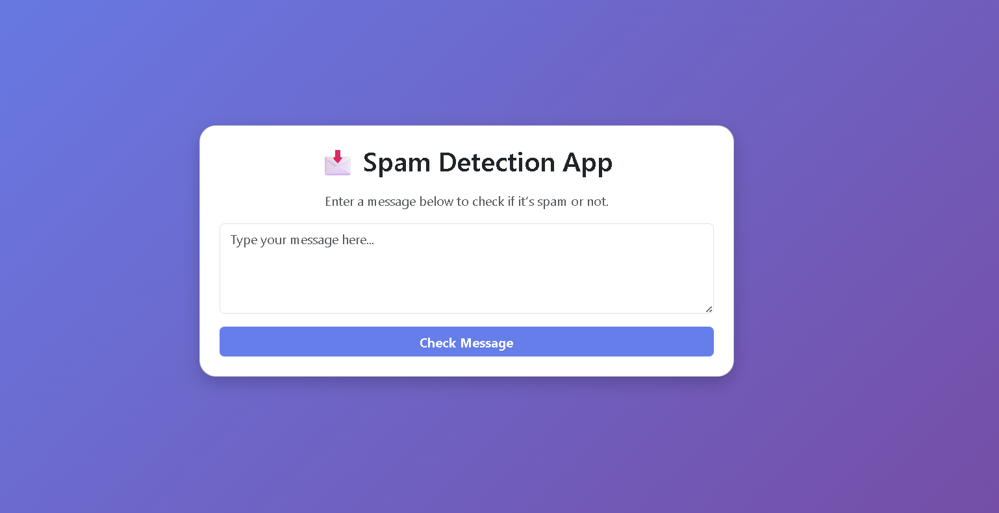

# Spam-Detection
# 📧 Spam Message Detection App

This is a simple Python-based Spam Detection Web App using **Machine Learning (Naive Bayes)** and **Scikit-learn**, deployed locally using **Gradio**.

---

## 🚀 Features

- Detects whether a message is **Spam** or **Ham**
- Trained on the classic `spam.csv` SMS dataset
- Uses `CountVectorizer` + `MultinomialNB` model
- Web UI powered by **Gradio**
- Saves trained model and vectorizer using `joblib`

---

## 🖼 Interface Preview


---

## 🧠 Tech Stack

- Python 3.x
- Pandas
- Scikit-learn
- Gradio
- Joblib

---

## 📂 File Structure

```bash
Spam Detect/
│
├── spam.csv              # Dataset file
├── train_model.py        # Trains and saves the model
├── app.py                # Gradio UI App
├── spam_model.pkl        # Trained ML model
├── vectorizer.pkl        # Fitted CountVectorizer
└── README.md             # Project documentation
